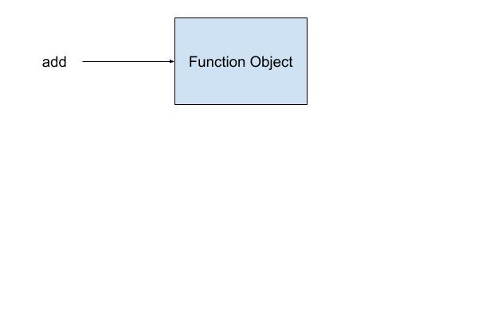
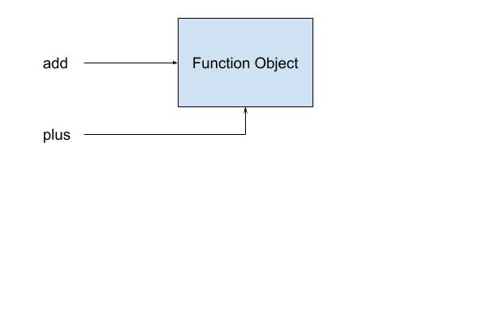
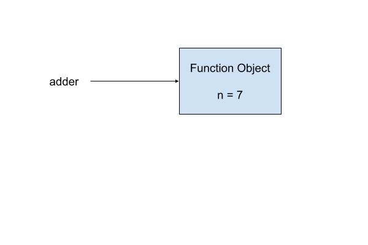
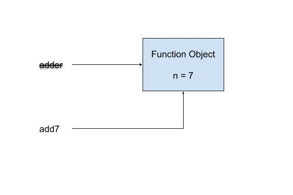

% 
% **Decorators** .:.  Miki Tebeka <miki@353solutions.com>

# Understanding Functions

Before we start talking about decorators, let's talk about Python's function.
In Python function are *first class objects*. This means that functions are like
any other object, we can create new ones, pass them around as function
parameters, query attributes ...

Say we have the following code

~~~ python
INCLUDE add.py
~~~

What Python does when we do a `def` is to compile the function code and create a
function object. Then it assigns the name `add` to point to this object.

We can access attributes

~~~ python
>>> add.__name__
'add
~~~

We can assign another variable to this function object.

~~~ python
plug = add
~~~

And how we have both `add` and `plus` pointing to the same function object.

We can even create functions on the fly

~~~ python
INCLUDE adder.py
~~~

The inner `adder` function remember the value of `n` at the time of it's
creation. This is called [closure](https://en.wikipedia.org/wiki/Closure_(computer_programming)).

When we do

~~~ python
add7 = make_adder(7)
~~~

When the function is called, we create a new function object that remember that
`n` is 7 and have the local variable `adder` point to it

`make_adder` return value is this function object and now `add7` points to it.

 

And now we can use it

~~~ python
>>> add7(10)
17
~~~

# Decorators

A decorator is a function^[Most of the time :)] that gets a function as a
parameter and returns a function.

Confusing? Let's see an example. Say you have a menu and you'd like to register
function to menu items, you might do the following:

~~~ python
INCLUDE menu-before.py
~~~

We can use decorators to make this code nicer

~~~ python
INCLUDE menu-after.py
~~~

This code has the same functionality. Every time you see

~~~ python
@some_decorator
def some_function(a, b):
    ....
~~~

It's like writing

~~~ python
def some_function(a, b):
    ...

some_function = some_decorator(some_function)
~~~

Registration is one common use for decorators, the other one is adding
functionality to functions without changing the source code. Let's say we'd like
to measure how long a function is running. Instead of adding the timing code
inside the function, we'll write a decorator that will start a time, call the
function and at the end will print how long it took^[In real life we'll probably
send a metric to a system like InfluxDB].

~~~ python
INCLUDE timed.py
~~~

Notes:

* The `wraps` decorator copies the function name and documentation string to the
  newly created function. This means the `help(add)` will show the help for
  `add` and not for the inner `wrapper` function that `add` is pointing to.
* We use `wrapper(*args, **kw)` so we can apply the decorator on different
  functions with different signatures^[A function `signature` is the number
  of arguments it accepts].
* We use `time.monotonic` to measure time, it is more accurate than `time.time`

# TL;DR

* Functions in Python are "first class objects". You can assign them to
  variables, pass them as parameters to other functions and create new ones
  during program run time
* A "closure" is the environment where a function was created. Functions in
  Python know their closure.
* A decorator is a function that get a function as argument and returns a
  function
* When you see
~~~ python
    @some_decorator
    def some_function(a, b):
	....
    ~~~

    It means

    ~~~ python
    def some_function(a, b):
	...

    some_function = some_decorator(some_function)
    ~~~
* Commons uses for decorators are registration and adding functionality to
  functions without changing their source code 
    
